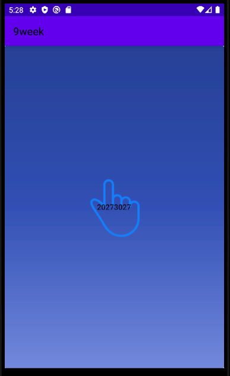

# 2021년 2학기 캡스톤디자인 안드로이드앱 프로그래밍

## 2주차 과제
- Github사용방법
- 안드로이드앱프로그래밍
- 앱기획

</img>

## 3주차 과제 (0930 제출)

</img>
</img>

## 4주차 과제
 - 아이디어 명: 더이상 혼자 독서하지 않기
 - 온라인 독서 클럽(북클럽 앱)
 - 코로나로 인해 온라인 모임이 활성화 되고 있는 요즘 클럽 구독자들끼리 자체적으로 책 // 모임이 진행되는 요일을 정해 자체적으로 책의 소감이나 토론을 공간과 시간의 제약 없이 온라인으로 나눌 수 있도록 하는 것이 목표이다
 - 회원 가입 시에 선택한 책에 따라 생성되어 있는 온라인 북클럽 모임에 참가할 수 있으며 무료/유료 회원 간의 혜택이 존재한다
 - 유료 회원은 북클럽을 창설할 수 있으며, 구독 기간에 따라서 비정기적으로 자사 굿즈 / 혹은 계간지 / 이달의 베스트셀러 책을 받아볼 수 있다
 - 무료 회원은 북클럽 가입만 가능하며, 첫 1달은 모든 회원이 유로 회원 혜택을 무료로 받아볼 수 있다
 -

## 5주차 과제

</img>
</img>

## 6주차 과제

</img>
</img>
</img>
</img>

## 7주차 과제
LMS 제출

## 중간고사
LMS 제출

## 9주차 과제
</img>
</img>

## 10주차 과제
</img>
</img>
</img>
</img>
